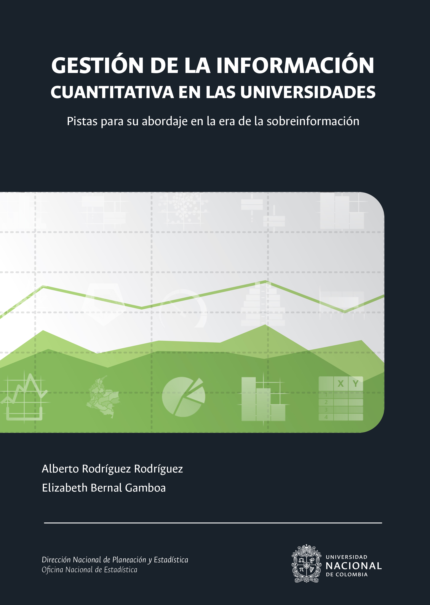
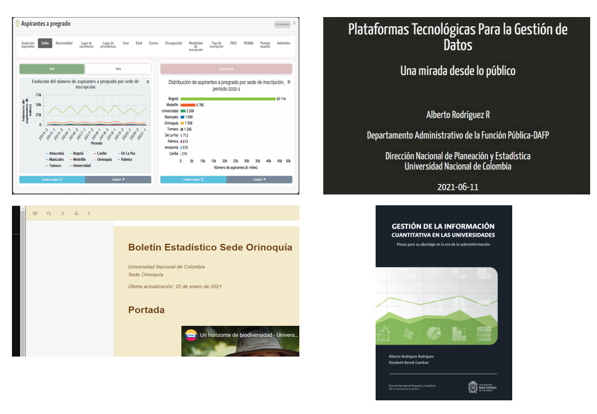
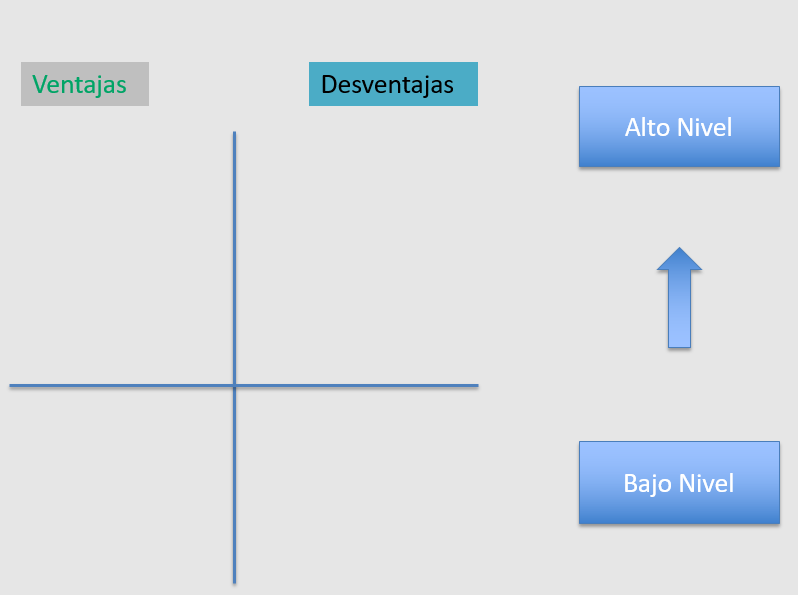
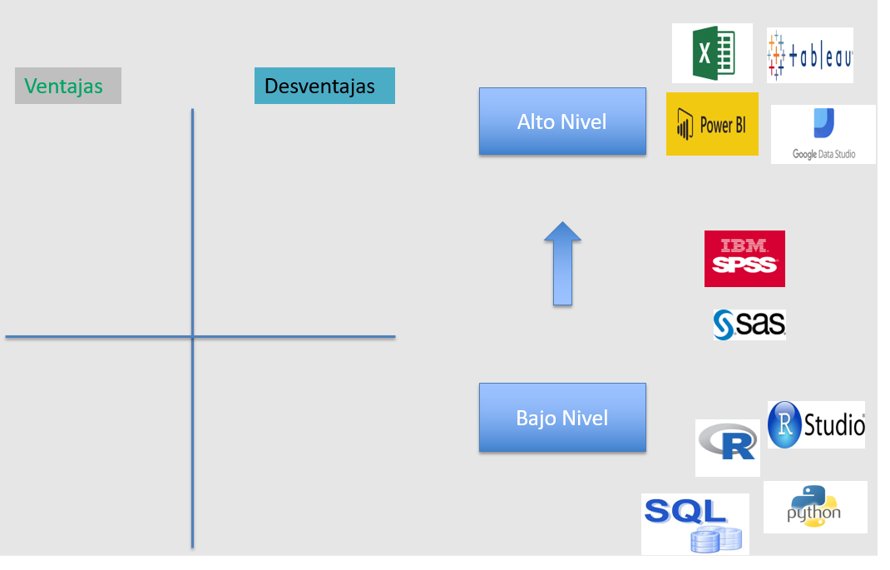
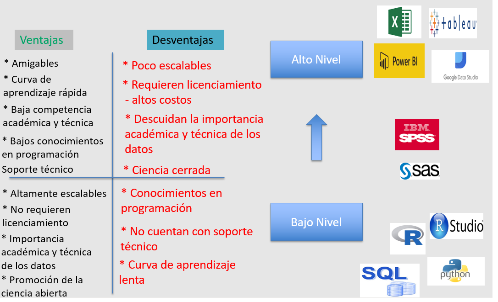
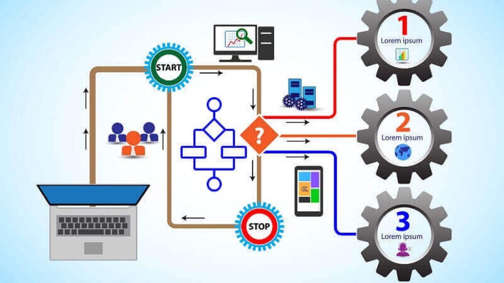
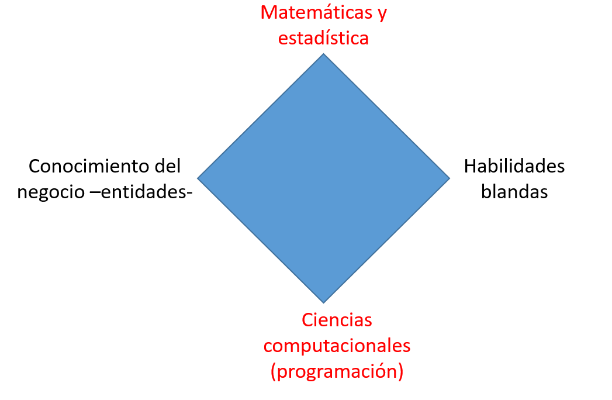
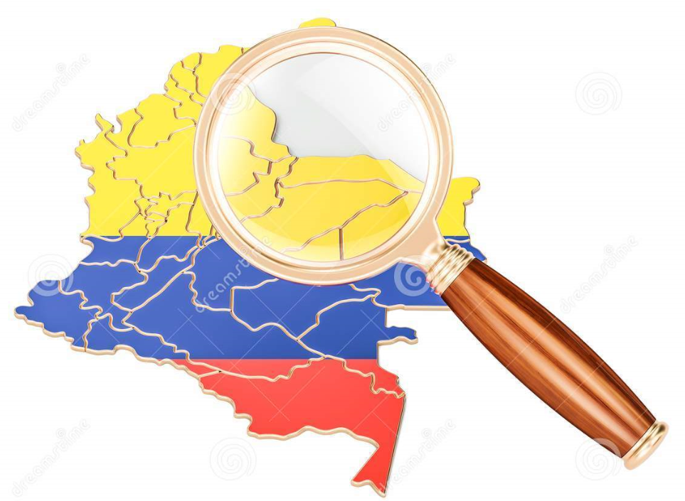
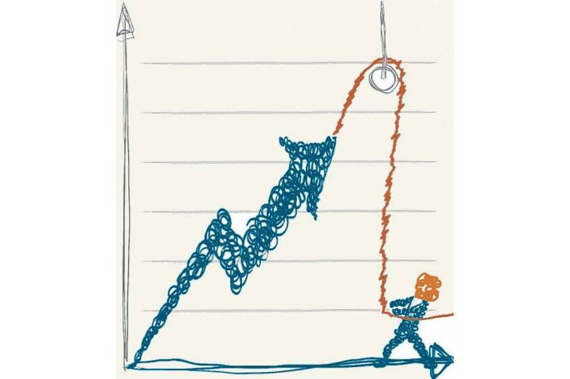

```{r setup, include=FALSE}
options(htmltools.dir.version = FALSE,  htmltools.preserve.raw = FALSE)
```

<!-- Uso de funcionalidades de xaringan extras -->

```{r xaringan-panelset, echo=FALSE}
xaringanExtra::use_panelset()
```

```{r xaringan-scribble, echo=FALSE}
xaringanExtra::use_scribble()
```

```{r xaringan-webcam, include = FALSE}
xaringanExtra::use_webcam()
```

```{r xaringan-logo, echo=FALSE}
xaringanExtra::use_logo(
  image_url = "https://raw.githubusercontent.com/estadisticaun/TendenciasCSU/master/Imagenes/LOGOSIMBOLO%20LATERAL.png", width = "115px",
  height = "133px")
```

```{r echo=FALSE}
xaringanExtra::style_panelset_tabs(
  active_foreground = "#0051BA",
  hover_foreground = "#d22",
  font_family = "Roboto"
)
```


<!-- INICIO DE LA PRESENTACIÓN -->

## Consideraciones para el uso adecuado de la presentación

  1.	<p style="font-size:100%  align="justify";> Dar click en la letra <b>H</b> o en el símbolo <b>?</b> para desplegar las distintas <b>opciones de navegación</b> que ofrece la presentación.</p>

---
## Contenido

<br>

1. <p align="justify">**Una premisa**
<br>
2. <p align="justify">**¿Cuáles son los beneficios de contar y de gestionar las herramientas tecnológicas en el contexto de los datos?**
<br>
3. <p align="justify">**En el ejercicio de gestión de los datos institucionales, ¿dónde se requiere contar con herramientas tecnológicas?**
<br>
4. <p align="justify">**En el contexto de lo público, ¿cuáles herramientas y plataformas tecnológicas se requieren para la gestión moderna de los datos?**

---
class: inverse, center, middle

# Una premisa

---
### Un riesgo para la gestión de la información cuantitativa en las entidades públicas
<h4 style="color:Red;">¡La tecnología como fin y no como medio!</h4>
<br>
```{r risk, fig.align='center', out.width='60%', fig.show='hold', echo=FALSE}

```
 
---
class: inverse, center, middle

# ¿Cuáles son los beneficios de contar y de gestionar las herramientas tecnológicas en el contexto de los datos?

---
# Posibilidades que nos ofrece la gestión moderna de las herramientas tecnológicas

Somos una generación privilegiada dada las posibilidades que nos ofrecen las TIC. En el contexto de los datos y su gestión en el ámbito de lo público, sólo por presentar algunos ejemplos, estas herramientas nos sirven para:


1. Presentar/visualizar información de estadísticas e indicadores

2. Construir boletines estadísticos interactivos

3. Construir y disponer libros

4. Realizar presentaciones

5. realizar investigaciones desde diversas perspectivas

6. Lo más importante, disponer en la web todo el conocimiento contenido en los datos institucionales (transparencia)

---
### 1. Ejemplo Dashboards - Aspirantes a pregrado - UNAL

.panelset[
.panel[.panel-name[Evolución]

<iframe width="100%" height="440px" frameborder="0" mozallowfullscreen="true" webkitallowfullscreen="true" allowfullscreen="true" src="https://estadisticaun.github.io/G_AspAdm/Nal/AspPre/Serie.html"></iframe>

<font size=1><i><b>Fuente:</b> Dirección Nacional de Planeación y Estadística con base en información provista por la Dirección Nacional de Admisiones</i></font> 
]
.panel[.panel-name[Sexo]

<iframe width="100%" height="440px" frameborder="0" mozallowfullscreen="true" webkitallowfullscreen="true" allowfullscreen="true" src="https://estadisticaun.github.io/G_AspAdm/Nal/AspPre/S_sexo.html"></iframe>

<font size=1><i><b>Fuente:</b> Dirección Nacional de Planeación y Estadística con base en información provista por la Dirección Nacional de Admisiones</i></font> 
]

.panel[.panel-name[Estrato]

<iframe width="100%" height="440px" frameborder="0" mozallowfullscreen="true" webkitallowfullscreen="true" allowfullscreen="true" src="https://estadisticaun.github.io/G_AspAdm/Nal/AspPre/S_estrato.html"></iframe>

<font size=1><i><b>Fuente:</b> Dirección Nacional de Planeación y Estadística con base en información provista por la Dirección Nacional de Admisiones</i></font> 
]

.panel[.panel-name[Nacimiento]
<iframe width="100%" height="440px" frameborder="0" mozallowfullscreen="true" webkitallowfullscreen="true" allowfullscreen="true" src="https://estadisticaun.github.io/G_AspAdm/Nal/AspPre/Nac_comb.html"></iframe>

<font size=1><i><b>Fuente:</b> Dirección Nacional de Planeación y Estadística con base en información provista por la Dirección Nacional de Admisiones</i></font> 
]

.panel[.panel-name[Inscripción]
<iframe width="100%" height="440px" frameborder="0" mozallowfullscreen="true" webkitallowfullscreen="true" allowfullscreen="true" src="https://estadisticaun.github.io/G_AspAdm/Nal/AspPre/S_modalidad.html"></iframe>

<font size=1><i><b>Fuente:</b> Dirección Nacional de Planeación y Estadística con base en información provista por la Dirección Nacional de Admisiones</i></font> 
]

.panel[.panel-name[PAES]
<iframe width="100%" height="440px" frameborder="0" mozallowfullscreen="true" webkitallowfullscreen="true" allowfullscreen="true" src="https://estadisticaun.github.io/G_AspAdm/Nal/AspPre/S_paes.html"></iframe>

<font size=1><i><b>Fuente:</b> Dirección Nacional de Planeación y Estadística con base en información provista por la Dirección Nacional de Admisiones</i></font> 
]

.panel[.panel-name[Tabla]
<iframe width="100%" height="400px" frameborder="0" mozallowfullscreen="true" webkitallowfullscreen="true" allowfullscreen="true" src="https://estadisticaun.github.io/G_AspAdm/Nal/AspPre/T_sede.html"></iframe>

<font size=1><i><b>Fuente:</b> Dirección Nacional de Planeación y Estadística con base en información provista por la Dirección Nacional de Admisiones</i></font> 
]
]

---
### 2. Ejemplo - Boletines Interactivos


### Sede Orinoquía - UNAL
<html>
<center>
<iframe width="580" height="320" src="https://www.youtube.com/embed/seEIJvhRPfg?rel=0&amp;controls=0&amp;showinfo=0" frameborder="0" gesture="media" allow="encrypted-media" allowfullscreen></iframe>
</center>
</html>

<br>

<font size=4><i>Ir al boletín estadístico de la Sede<br>
Disponible en:<a href="https://estadisticaun.github.io/BoletinOrinoquia1/">https://estadisticaun.github.io/BoletinOrinoquia1/</a></i></font> 

---
### 3. Ejemplo - Libros

```{r libroc, fig.align='center', out.width='45%', fig.show='hold', echo=FALSE}

```

<font size=2><b>Disponible en: </b><a href="https://estadisticaun.github.io/L_Conceptual">https://estadisticaun.github.io/L_Conceptual</a></font>


---
### 4. Ejemplo - Presentaciones


```{r Orquesta, fig.align='center', out.width='38%', fig.show='hold', echo=FALSE}

```

<p align="justify"><h4 style="color:Blue;">No hay mejor experiencia que la práctica/realidad. Esta presentación es una muestra de las posibilidades que nos ofrecen las TIC.</h4>
<br>


---
### 5. Ejemplo - Aproximaciones académicas

```{r fig100, fig.align='center', out.width='60%', fig.show='hold', echo=FALSE}
knitr::include_graphics('Imagenes/F_10.png')
```
<font size=2><b>Disponible en: </b><a href="https://raw.githubusercontent.com/estadisticaun/L_Conceptual/master/imagenes/F_10.png?token=AHYPBYTXQHTF43XSP72ZT53AXYMKC">Capítulo 3. Gestión de la Información en las Universidades.</a></font>

---
### 6. Ejemplo - Disponer la información cuantitativa en la web

En la actualidad, la web es quizás el mejor instrumento tecnológico para la **transparencia institucional** y la **rendición permanente de cuentas**.<br> 
<h5 style="color:Red;">¡Lo que no está en internet, "parece que no existe"!

```{r web, fig.align='center', out.width='80%', fig.show='hold', echo=FALSE}

```

---
class: inverse, center, middle

# En el ejercicio de gestión de los datos institucionales, ¿dónde se requiere contar con herramientas tecnológicas?

---
#### Herramientas tecnológicas y cadena de valor del dato

.panelset[

.panel[.panel-name[Cadena de valor]
]

.panel[.panel-name[Datos]
]

.panel[.panel-name[Transformación y almacenamiento]
]

.panel[.panel-name[Información]
]

.panel[.panel-name[Comunicación]
]

.panel[.panel-name[Las decisiones]
]

]


---
class: inverse, center, middle

# En el contexto de lo público, ¿cuáles herramientas y plataformas tecnológicas se requieren para la gestión moderna de los datos?

---
## Herramientas y plataformas tecnológicas

.panelset[

.panel[.panel-name[Lo primero]

<br>

* En el ejercicio de selección de herramientas, en lo público, debe primar la **neutralidad tecnológica**. 

* El problema central para la selección de herramientas, además de su costo, es su variedad y su cantidad. 
<h4 style="color:Red;">¡Hoy no escasean las plataformas y herramientas para la gestión de datos; hoy, en sentido estricto, sobran!

]

.panel[.panel-name[Tipos]
```{r Herra1, fig.align='center', out.width='70%', fig.show='hold', echo=FALSE}

```
]

.panel[.panel-name[Herramientas]
```{r Herra2, fig.align='center', out.width='75%', fig.show='hold', echo=FALSE}

```
<font size=2><b>Enlace: </b><a href="https://keshif.me/demo/VisTools#515">Un inventario de herramientas tecnológicas para la visualización de los datos.</a></font>
]

.panel[.panel-name[Ventajas y desventajas]
```{r Herra3, fig.align='center', out.width='90%', fig.show='hold', echo=FALSE}

```
]

.panel[.panel-name[La nube]
]

.panel[.panel-name[La web]
]

]


---
# Ejemplo anterior
.panelset[
.panel[.panel-name[1.Dashboards]

.pull-left[
<br>
<br>
```{r figGes, fig.align='center', out.width='100%', fig.show='hold', echo=FALSE}
knitr::include_graphics('Imagenes/Gestion.jpg')
```
]

.pull-right[
- <p align="justify">Gestión pública orientada por procesos y a través de lineamientos contenidos en normas estandarizadas tipo ISO. Por ejemplo, la experiencia de Colombia con la construcción e implementación de la **NTCPG 1000**.

- <p align="justify">Necesidad de contar con <FONT COLOR="red"><u>indicadores de gestión</u></FONT> por procesos.
]
]

.panel[.panel-name[2.Boletines]

.pull-left[
<br>
<br>
```{r figTra, fig.align='center', out.width='100%', fig.show='hold', echo=FALSE}

```
]

.pull-right[
<p align="justify">[LEY 1712 DE 2014](https://www.funcionpublica.gov.co/eva/gestornormativo/norma.php?i=56882). Por medio de la cual se crea la <u>Ley de Transparencia</u> y del Derecho de Acceso a la Información Pública Nacional

- **Artículo 11.** Literal d (disposición de <FONT COLOR="red"><u>indicadores de desempeño.</u></FONT>)

- **Artículo 11.** Literal k (publicación de <FONT COLOR="red"><u>datos abiertos.</u></FONT>)

<p align="justify">[LEY ESTATUTARIA 1581 DE 2012](https://www.funcionpublica.gov.co/eva/gestornormativo/norma.php?i=49981#:~:text=La%20presente%20ley%20tiene%20por,el%20art%C3%ADculo%2015%20de%20la). Protección de datos personales (*Habeas Data*).
]
]

.panel[.panel-name[3.Libros]

.pull-left[
<br>
<br>
```{r figCont, fig.align='center', out.width='100%', fig.show='hold', echo=FALSE}

```
]

.pull-right[

#### Control Externo

- Apuesta nacional por alcanzar un **control fiscal en tiempo real**. 

- Disposición de bases de datos<FONT COLOR="red"><u> intercambio de datos</u></FONT>

#### Control Interno

- <p align="justify"> Necesidad de contar con información cuantitativa a nivel institucional. Gestionarse y comunicarse de manera adecuada. 

]

]
.panel[.panel-name[4.Presentaciones]

.pull-left[
<br>
<br>
```{r figOpen, fig.align='center', out.width='100%', fig.show='hold', echo=FALSE}
knitr::include_graphics('Imagenes/Abiertos.jpg')
```

]

.pull-right[

#### Carga de microdatos en portales de datos abiertos

- Consolidación y disposición de <FONT COLOR="red"><u> conjuntos de datos abiertos</u></FONT> en el portal de datos del estado colombiano (https://www.datos.gov.co/).

#### Intercambio de microdatos entre entidades

- <p align="justify"> Entrega - <FONT COLOR="red"><u>carga de datos</u></FONT> a sistemas de información sectorial y nacional.

]

]
.panel[.panel-name[6.Estadísticas e indicadores]

.pull-left[
<br>
<br>
```{r figEstad, fig.align='center', out.width='100%', fig.show='hold', echo=FALSE}
knitr::include_graphics('Imagenes/Estadisticas.png')
```
]

.pull-right[
<p align="justify">Construcción y disposición de <FONT COLOR="red"><u>estadísticas e indicadores</u></FONT> a nivel institucional.

<br>
- Estadísticas cifras <u>***oficiales***</u>
  [Sistema Estadístico Nacional](https://www.dane.gov.co/index.php/sistema-estadistico-nacional-sen#sistemas-de-consulta-sen)
  [NTCPE-1000](https://www.dane.gov.co/index.php/norma-tecnica-de-la-calidad)
<br>
<br>
- <u>***Indicadores***</u> estadísticos
<br>
<br>
- Indicadores de desarrollo o <u>***cumplimiento***</u> [Guía de indicadores - DNP](https://colaboracion.dnp.gov.co/CDT/Sinergia/Documentos/Guia_para_elaborar_Indicadores.pdf)

]

]
.panel[.panel-name[7.Benchmarking]

.pull-left[
<br>
<br>
```{r figRank, fig.align='center', out.width='100%', fig.show='hold', echo=FALSE}
knitr::include_graphics('Imagenes/Rankings.png')
```
]

.pull-right[
<br>
<br>
- Incursión, en el contexto de lo público, del <FONT COLOR="red"><u>mercado de los datos.</u></FONT>

- <p align="justify"> En el contexto de la gestión de los datos con propósitos de <u>comparación o benchmarking</u> lo que está en juego es el prestigio institucional. 
]

]
]

---
class: inverse, center, middle

# ¿Cuál es la fuente/base de la información cuantitativa?


---
### Los datos y sus diversos propósitos/caminos

.panelset[
.panel[.panel-name[1.Los datos]

<br>
<br>

#### ¿Qué son los datos?

<p align="justify"> Los datos son una representación simbólica cuantitativa o cualitativa de una característica particular de la realidad que se obtiene a través de un procedimiento de captura o transferencia.

]
.panel[.panel-name[2.Tipos]
```{r fig9, fig.align='center', out.width='47%', fig.show='hold', echo=FALSE}
knitr::include_graphics('Imagenes/F_9.png')
```
<font size=2><b>Disponible en: </b><a href="https://raw.githubusercontent.com/estadisticaun/L_Conceptual/master/imagenes/F_9.png?token=AHYPBYXQ2ZQXAQDE7VOR7ILAXYMBM">Capítulo 3. Gestión de la Información en las Universidades.</a></font>
]
.panel[.panel-name[3.Aproximaciones académicas]
```{r fig10, fig.align='center', out.width='50%', fig.show='hold', echo=FALSE}
knitr::include_graphics('Imagenes/F_10.png')
```
<font size=2><b>Disponible en: </b><a href="https://raw.githubusercontent.com/estadisticaun/L_Conceptual/master/imagenes/F_10.png?token=AHYPBYTXQHTF43XSP72ZT53AXYMKC">Capítulo 3. Gestión de la Información en las Universidades.</a></font>
]

.panel[.panel-name[4.Usos]
```{r fig11, fig.align='center', out.width='50%', fig.show='hold', echo=FALSE}
knitr::include_graphics('Imagenes/F_11.png')
```
<font size=2><b>Disponible en: </b><a href="https://raw.githubusercontent.com/estadisticaun/L_Conceptual/master/imagenes/F_11.png?token=AHYPBYUOPHLK4JYLWLG2CDTAXYMPK">Capítulo 3. Gestión de la Información en las Universidades.</a></font>
]
.panel[.panel-name[5.La tecnología]
```{r fig14, fig.align='center', out.width='47%', fig.show='hold', echo=FALSE}
knitr::include_graphics('Imagenes/F_14.png')
```
<font size=2><b>Disponible en: </b><a href="https://raw.githubusercontent.com/estadisticaun/L_Conceptual/master/imagenes/F_14.png?token=AHYPBYXH34UNHZARFJBRGH3AXYMUU">Capítulo 3. Gestión de la Información en las Universidades.</a></font>
]
.panel[.panel-name[6.En conclusión]
```{r fig15, fig.align='center', out.width='50%', fig.show='hold', echo=FALSE}
knitr::include_graphics('Imagenes/F_15.png')
```
<font size=2><b>Disponible en: </b><a href="https://raw.githubusercontent.com/estadisticaun/L_Conceptual/master/imagenes/F_15.png?token=AHYPBYQFCOYZIXYVBWENHHTAXYIOQ">Capítulo 3. Gestión de la Información en las Universidades.</a></font>
]


.panel[.panel-name[7.Contexto de la analítica]
```{r fig16, fig.align='center', out.width='50%', fig.show='hold', echo=FALSE}
knitr::include_graphics('Imagenes/Figura16.jpg')
```
<font size=2><b>Disponible en: </b><a href="https://raw.githubusercontent.com/estadisticaun/DAFP_informacion/main/Imagenes/Figura16.jpg">Ver imagen ampliada.</a></font>
]

]

---
class: inverse, center, middle

# ¿Cuáles son los requisitos para la gestión de la información cuantitativa?

---
### Requisitos para la gestión de la información cuantitativa

.panelset[
.panel[.panel-name[1.El propósito]
<br>
Los datos, en el contexto de las estidades públicas en Colombia, pueden ser requeridos/utilizados para **cuatro (4) grandes propósitos.**

.pull-left[
<FONT COLOR="red">1. Construcción de estadísticas e indicadores</FONT>

  - Las estadísticas: [un ejemplo](https://n9.cl/xpc7)
  
  - Los indicadores

<FONT COLOR="red">2. Disposición de datos abiertos</FONT>

  - Portal de datos del estado colombiano: [ir al portal](https://www.datos.gov.co/)
]

.pull-right[

<FONT COLOR="red">3. Intercambio de datos</FONT>

  - Lineamientos tecnológicos

<FONT COLOR="red">4. Uso de datos para propósitos analíticos</FONT>

  - Propósito
  
  - Neutralidad académica 
]


]
.panel[.panel-name[2.Los lineamientos]

Lineamientos disponibles para la gestión de la información cuantitativa.

.pull-left[

- <FONT COLOR="red">Estadísticas e indicadores</FONT>

###### [1. Sistema Estadístico Nacional](https://www.dane.gov.co/index.php/sistema-estadistico-nacional-sen#sistemas-de-consulta-sen)
###### [2. NTCPE-1000](https://www.dane.gov.co/index.php/norma-tecnica-de-la-calidad)
###### [3. Guía para la construcción y análisis de indicadores - DNP](https://colaboracion.dnp.gov.co/CDT/Sinergia/Documentos/Guia_para_elaborar_Indicadores.pdf)
###### [4. Guía para la construcción y análisis de indicadores de gestión - DAFP](https://www.funcionpublica.gov.co/documents/418548/34150781/Gu%C3%ADa+para+la+construcci%C3%B3n+y+an%C3%A1lisis+de+Indicadores+de+Gesti%C3%B3n+-+Versi%C3%B3n+4+-+Mayo+2018.pdf/0e0d10e4-0ec0-6781-21e9-f2bedfd0e18a?t=1533038939417&download=true)

- <FONT COLOR="red">Datos abiertos</FONT>

###### [Resolución 1519 del 2020 - Mintic - Anexo 4](https://normograma.mintic.gov.co/mintic/docs/resolucion_mintic_1519_2020.htm)


]

.pull-right[

###### [Portal de datos abiertos del estado colombiano](https://www.datos.gov.co/)

- <FONT COLOR="red">Intercambio de datos</FONT>

###### [Marco de interoperabilidad para gobierno digital](https://www.mintic.gov.co/arquitecturati/630/articles-9375_recurso_4.pdf)

- <FONT COLOR="red">Propósitos analíticos</FONT>

###### [CONPES 3920 -2018- Política Nacional de Explotación de Datos (Big Data)](https://colaboracion.dnp.gov.co/CDT/Conpes/Econ%C3%B3micos/3920.pdf)

###### [CONPES 3975 -2019- Política Nacional Para la Transformación Digital e Inteligencia Artificial)](https://colaboracion.dnp.gov.co/CDT/Conpes/Econ%C3%B3micos/3975.pdf)

###### [Metodología CRISP-DM](https://es.wikipedia.org/wiki/Cross_Industry_Standard_Process_for_Data_Mining)

]


]

.panel[.panel-name[3.El talento humano]

<p align="justify">La gestión contemporánea de los datos a nivel de las entidades pública exige un perfil profesional o, un grupo de profesionales, experto(s) en las siguientes competencias.
<br>
.pull-left[
```{r Compe, fig.align='center', out.width='70%', fig.show='hold', echo=FALSE}

```
]
.pull-right[
- <FONT COLOR="red">Matemáticas y estadística</FONT>


- <FONT COLOR="red">Ciencias computacionales (programación)</FONT>


- <FONT COLOR="red">Conocimiento del negocio -entidades-</FONT>


- <FONT COLOR="red">Habilidades blandas</FONT> 
]
]
.panel[.panel-name[4.Las herramientas]

.pull-left[
```{r Herra, fig.align='center', out.width='90%', fig.show='hold', echo=FALSE}
knitr::include_graphics('Imagenes/F_14.png')
```
<font size=2><b>Disponible en: </b><a href="https://raw.githubusercontent.com/estadisticaun/L_Conceptual/master/imagenes/F_14.png?token=AHYPBYXH34UNHZARFJBRGH3AXYMUU">Capítulo 3. Gestión de la Información en las Universidades.</a></font>
]

.pull-right[
- <FONT COLOR="red">Alto Nivel</FONT>

Por ejemplo:

PowerBI, Tableau, DataStudio, Pentahoo, flourish, Qlick, SPSS, Kmine, RapidMiner, Excel, etc. 


- <FONT COLOR="red">Bajo Nivel</FONT>

Por ejemplo:

R, Rstudio, Python, SAS, Stata, HTLM, CSS, JavaScrip, Git, etc. 


<font size=2><b>Ver enlace en: </b><a href="https://keshif.me/demo/VisTools#515">Un inventario de herramientas tecnológicas para la gestión de los datos.</a></font>

]
]

.panel[.panel-name[5.Una apuesta institucional]

<p align="justify"> La gestión de la información cuantitativa a nivel de las entidades públicas debe surgir de una apuesta institucional. Esta apuesta debe contener, en lo posible, los siguientes aspectos constitutivos.

.pull-left[
```{r proceso, fig.align='center', out.width='100%', fig.show='hold', echo=FALSE}

```
]
.pull-right[

- <FONT COLOR="red">Apoyo desde la alta dirección (estratégico)</FONT>
- <FONT COLOR="red">Lugar en la estructura de la entidad -en el organigrama-</FONT>

- <FONT COLOR="red">Planeación Estadística</FONT>

- <FONT COLOR="red">Talento humano disponible</FONT>

- <FONT COLOR="red">Herramientas tecnológicas</FONT>

- <FONT COLOR="red">Recursos metodológicos</FONT>

- <FONT COLOR="red">Recursos financieros</FONT>

]
]


]

---
class: inverse, center, middle

# ¿Cuáles son los riesgos que enfrenta la gestión de la información cuantitativa?

---
### Riesgos para la gestión de la información cuantitativa
.panelset[

.panel[.panel-name[Riesgo 1]
<h4 style="color:Red;">Una actividad puntual y no un proceso</h4>
<br>
```{r risk1, fig.align='center', out.width='60%', fig.show='hold', echo=FALSE}

```
]

.panel[.panel-name[Riesgo 2]
<h4 style="color:Red;">La tecnología como fin y no como medio</h4>
<br>
```{r risk2, fig.align='center', out.width='60%', fig.show='hold', echo=FALSE}

```
]
.panel[.panel-name[Riesgo 3]
<h4 style="color:Red;">El riesgo de las modas</h4>
<br>
```{r risk3, fig.align='center', out.width='60%', fig.show='hold', echo=FALSE}

```
]

.panel[.panel-name[Riesgo 4]
<h4 style="color:Red;">Lo complejo sinónimo de bueno; lo simple, de malo o mediocre  </h4>
<br>
```{r risk4, fig.align='center', out.width='70%', fig.show='hold', echo=FALSE}

```
]
.panel[.panel-name[Riesgo 5]
<h4 style="color:Red;">El desconocimiento de las competencias</h4>
<br>
```{r risk5, fig.align='center', out.width='70%', fig.show='hold', echo=FALSE}

```

]
.panel[.panel-name[Riesgo 6]
<h4 style="color:Red;">El gobierno antes que el Estado</h4>
```{r risk6, fig.align='center', out.width='50%', fig.show='hold', echo=FALSE}

```
]
.panel[.panel-name[Riesgo 7]
<h4 style="color:Red;">La ética en la producción y uso de datos y cifras</h4>
<br>
```{r risk7, fig.align='center', out.width='60%', fig.show='hold', echo=FALSE}

```
]
]

---
### Más sobre la gestión de la información cuantitativa
<p align="justify">Algunas de las ideas contenidas en esta presentación hacen parte del libro **Gestión de la Información Cuantitativa en la Universidades - Pistas para su abordaje en la era de la sobreinformación.**

<br>
```{r libro, fig.align='center', out.width='35%', fig.show='hold', echo=FALSE}

```

<font size=2><b>Disponible en: </b><a href="https://estadisticaun.github.io/L_Conceptual">https://estadisticaun.github.io/L_Conceptual</a></font>

---
class: inverse, center, middle

# ¡Muchas gracias!
<br>
## El contenido de esta presentación se encuentra disponible en:<br>
[https://estadisticaun.github.io/DAFP_informacion/#1](https://estadisticaun.github.io/DAFP_informacion/#1)
<br>
## Información de contacto:
Nombre: Alberto Rodríguez R <br>
Mail: albrodriguezr@unal.edu.co <br> estadistica_nal@unal.edu.co<br>
Teléfono: 3165000 Ext. 18519 - 18159<br>
